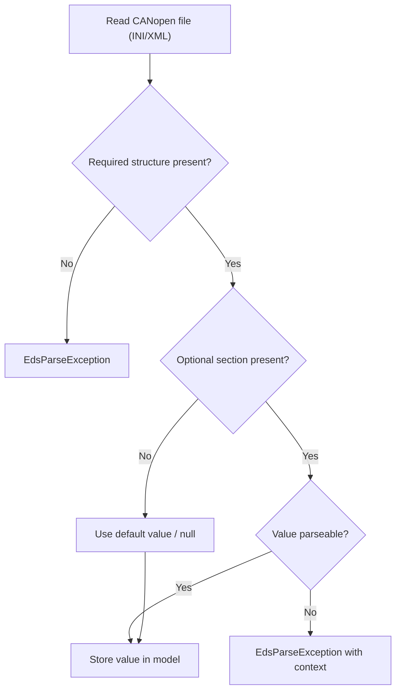
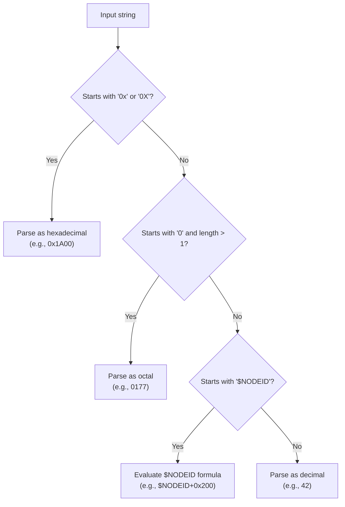
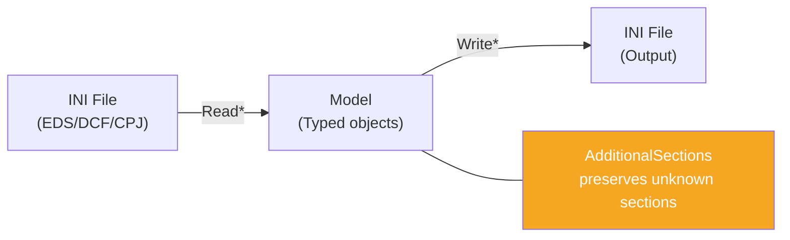
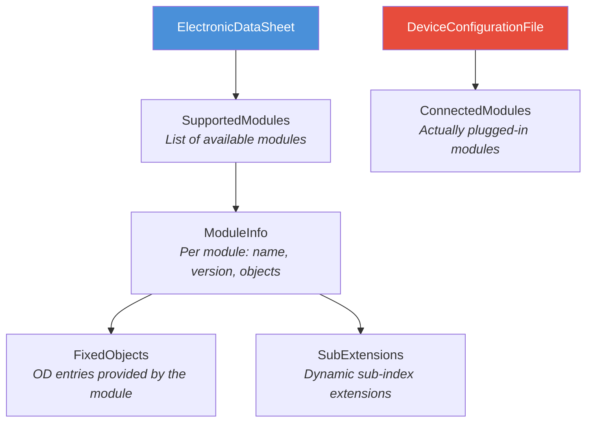
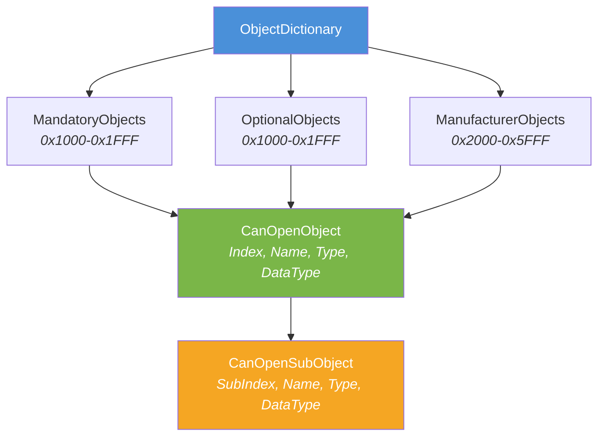

# 8. Crosscutting Concepts

## 8.1 Error Handling

### Strategy

The library uses **exceptions** as its primary error mechanism:

| Exception               | Use Case                                                    | Additional Information       |
|-------------------------|-------------------------------------------------------------|------------------------------|
| `EdsParseException`     | Errors during EDS/DCF/CPJ/XDD/XDC parsing                   | `LineNumber`, `SectionName`  |
| `EdsWriteException`     | Errors during EDS writing                                   | `SectionName`                |
| `DcfWriteException`     | Errors during DCF writing                                   | `SectionName`                |
| `CpjWriteException`     | Errors during CPJ writing                                   | `SectionName`                |
| `XddWriteException`     | Errors during XDD writing                                   | `SectionName`                |
| `XdcWriteException`     | Errors during XDC writing (including commissioning validation) | `SectionName`             |
| `ArgumentException`     | Invalid input parameters where validation is performed by the API | Standard .NET          |

> **Note:** `CanOpenFile.Eds.ConvertToDcf` (and the obsolete `CanOpenFile.EdsToDcf` facade that delegates to it), DCF parsing, and XDC writing enforce CANopen Node-ID constraints for explicit commissioning data. EDS-to-DCF conversion and DCF parsing require `1..127`; XDC writing emits commissioning only when a configured NodeId is present and valid and throws `XdcWriteException` for out-of-range values.

> **Compatibility note (AccessType):** Parsing of invalid or unknown `AccessType` values is intentionally tolerant and falls back to `ReadOnly` instead of failing. This is a deliberate trade-off to maximize interoperability with non-compliant manufacturer EDS/DCF files.

### Error Tolerance



- **Required fields**: Missing required sections result in an `EdsParseException`.
- **Optional fields**: Missing optional values result in `null` or default values.
- **Unknown INI sections**: Preserved in `AdditionalSections` (no warning, no error).
- **CiA 311 XML**: Parsed against supported profile structures; unsupported XML nodes are not represented as generic passthrough data.

### Input Size Limits

To mitigate memory-pressure and oversized-input scenarios, all read APIs enforce a default
maximum input size of `IniParser.DefaultMaxInputSize` (10 MB).

The limit is configurable per read operation on each format entry point
(`ReadFile`, `ReadFileAsync`, `ReadString`, `ReadStream`, `ReadStreamAsync`)
for EDS/DCF/CPJ/XDD/XDC via `CanOpenFileOptions`.

Guideline: keep the default for untrusted inputs and raise limits only as needed for
trusted, known-large payloads.

## 8.2 Culture Independence (InvariantCulture)

CANopen INI/XML files are culture-independent. Numeric values use deterministic formats and must not depend on OS locale.

### Rule

Every numeric or date-related parse/format operation **must** use `CultureInfo.InvariantCulture`:

```csharp
// Correct
int.TryParse(value, NumberStyles.Integer, CultureInfo.InvariantCulture, out var result);
value.ToString(CultureInfo.InvariantCulture);

// Wrong -- depends on system culture
int.TryParse(value, out var result);
value.ToString();
```

## 8.3 Number Format Processing

The `ValueConverter` supports three number formats specified in CiA DS 306:



### $NODEID Formula

DCF files can contain values computed relative to the node ID:

| Example                 | Node ID = 5 | Result   |
|------------------------|-------------|----------|
| `$NODEID`              | 5           | 5        |
| `$NODEID+0x600`        | 5           | 1541     |
| `$NODEID+0x200`        | 5           | 517      |

## 8.4 Round-Trip Fidelity

A core design principle is **round-trip fidelity**: EDS/DCF/CPJ files that are read and written back unchanged should not lose any information.



Mechanisms (INI formats):
- **`AdditionalSections`**: All sections not mapped by the model are stored as raw key-value pairs and written back during output.
- **`LastEds`**: DCF files store the filename of the source EDS.

For CiA 311 XML, round-trip behavior is guaranteed for the currently mapped schema subset used by `XddReader`/`XdcReader` and `XddWriter`/`XdcWriter`.

## 8.5 CiA 311 XML Mapping

CiA 311 support is implemented through explicit mapping of ISO 15745 profile elements to shared domain models:

- `CANopenObject` / `CANopenSubObject` attributes map to Object Dictionary objects/sub-objects.
- XDC `actualValue` and `denotation` map to `ParameterValue` and `Denotation`.
- `deviceCommissioning` maps to `DeviceCommissioning`.

XDC writer behavior:
- NodeId `0` means "commissioning not configured" and omits the XML `deviceCommissioning` element.
- NodeId `1..127` emits a valid `deviceCommissioning` element.
- Out-of-range NodeId values cause an `XdcWriteException`.

## 8.6 Modular Devices (CiA DS 306)

CANopen supports modular devices (e.g., bus couplers with pluggable I/O modules). EdsDcfNet fully represents this concept:



## 8.7 CANopen Object Dictionary Structure

The Object Dictionary is the heart of every CANopen device:



### Object Types

| ObjectType | Value | Description                                     |
|------------|-------|-------------------------------------------------|
| VAR        | 0x07  | Single variable                                 |
| ARRAY      | 0x08  | Array with homogeneous sub-objects              |
| RECORD     | 0x09  | Structure with heterogeneous sub-objects        |

### Access Types

| Enum Value           | Abbreviation | Meaning                        |
|----------------------|--------------|--------------------------------|
| `ReadOnly`           | `ro`         | Read only                      |
| `WriteOnly`          | `wo`         | Write only                     |
| `ReadWrite`          | `rw`         | Read and write                 |
| `ReadWriteInput`     | `rwr`        | Read/write (process input)     |
| `ReadWriteOutput`    | `rww`        | Read/write (process output)    |
| `Constant`           | `const`      | Constant, not modifiable       |
